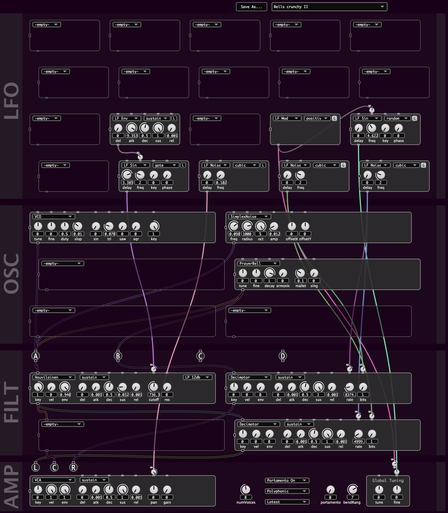

# ESynth

Work in progress semi-modular SuperCollider synth with patching interface that will scale from monophonic to paraphonic to polyphonic.

Aiming for a framework that supports experimenting with / easily adding new modules.

Requirements:
- Connection quark
- Houvilainen filter (https://github.com/esluyter/houvilainenfilter)
- Simplexsynth (https://github.com/esluyter/simplexsynth)

