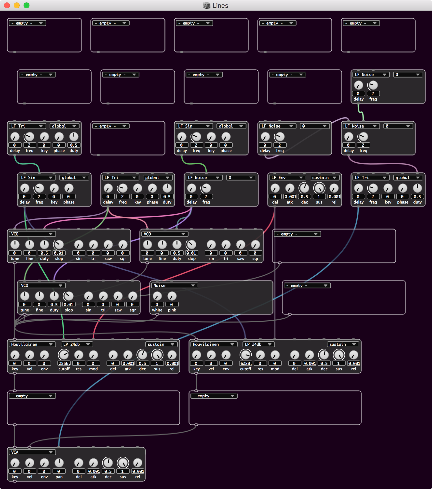

# ESynth

Work in progress semi-modular SuperCollider synth with patching interface that will scale from monophonic to paraphonic to polyphonic.

Aim at the fun to be had patching analog synths -- want it to sound as good as my boog.

Aim for a framework that supports experimenting with / easily adding new modules.

